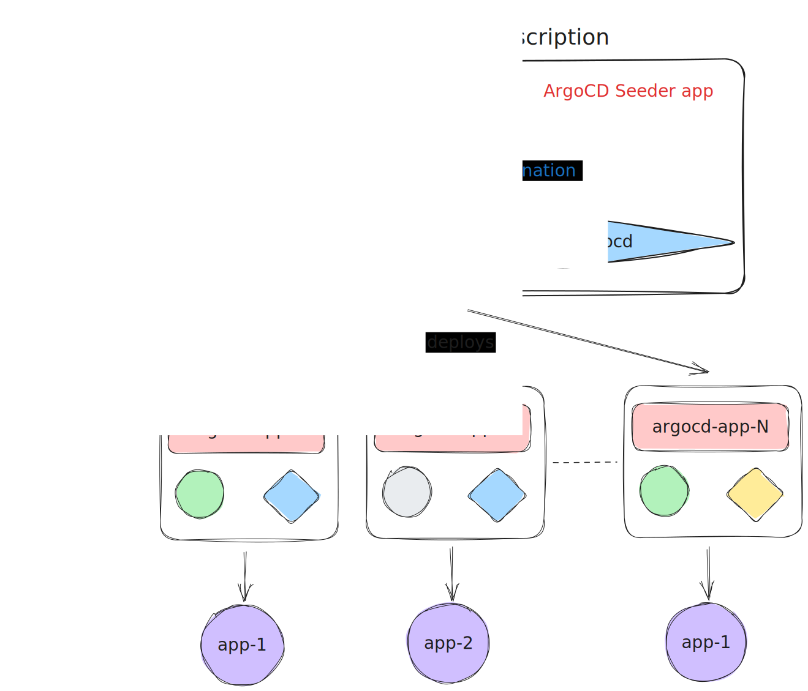

# ArgoCD deployment and `seeder`
This directory contains ArgoCD baseline deployment configuration and `seeder`. The latter is a simple ArgoCD Application monitoring an specific directory which contains [other ArgoCD Applications](https://argo-cd.readthedocs.io/en/stable/operator-manual/cluster-bootstrapping/).




## `chart/`: Installation with Helm
The community maintained Charts for [ArgoCD 5.41.2 are used](https://github.com/argoproj/argo-helm/tree/argo-cd-5.42.1)

### NOTE ABOUT CURRENT VERSION
This Chart uses the official one as dependency. In this way we inject in-house Secrets.

Secrets are kept in a cloud GCP Secret Store, which is accessed via an [External Secrets Operator (ESO)](https://github.com/external-secrets/external-secrets) deployed `in-cluster`.

This instance is bootstrapped github credentials via **External Secrets** (following structure proposed in ArgoCD for [SSH Repository Secrets](https://argo-cd.readthedocs.io/en/stable/operator-manual/declarative-setup/#repositories)). Other repositories refer to this credential, as no secret information is then needed these are bootstrapped with normal Secrets. For an example on the External Secret see [`github-credentials.yaml`](./templates/github-credentials.yaml) and other [templates](./chart/templates/).

## 1. Get dependencies
```bash
helm dependency build
```

## 2. Check `values.yaml` file
You can review the [default values for the release](https://github.com/argoproj/argo-helm/blob/argo-cd-5.41.2/charts/argo-cd/values.yaml).

This instance defines its parameters in [`argocd.yaml`](./chart/argocd.yaml).

**NOTE:** the `helmfile` plugin allows the deployment using, yes, helmfile. This is added as a sidecar to the `.repoServer`, and can be seen in the provided [`argocd.yaml`](./argocd.yaml) values file.

## 3. Deploy using `helm`
```bash
# check what's to be deployed
RELEASE="new-argo"
NAMESPACE="example"
VALUES="argocd.yaml"

# add --dry-run=client to check manifests without apply
helm upgrade --install $RELEASE . --namespace $NAMESPACE -f $VALUES
```

### Notes about default password
You can retrieve the initial auto-generated password from a newly created secret in `$NAMESPACE`:
```bash
kubectl get get secret argocd-initial-admin-secret -ojsonpath='{.data.password}'
```

Alternatively, use the `argocd` CLI tool:
```bash
# retrieve password
argocd admin initial-password -n argocd
```

## Adding cluster to this instance
The most effective way to add a cluster to ArgoCD is by using `argocd` CLI. An admin may then add a cluster that already exists in the Kubernetes `KUBECONFIG` context by simply:
```bash
CONTEXT_NAME="my-new-cluster"
argocd cluster add $CONTEXT_NAME
```

This will generate a Kubernetes Secret usually with the `cluster-` preffix. We may then retrieve such values and **create a new GCP Secret**, which we will reference with an External Secrets as to keep these values safely stored for further bootstrapping. So, the steps are:
1. Add a cluster using [ArgoCD CLI](https://argo-cd.readthedocs.io/en/stable/cli_installation/)
2. Retrieve the created cluster Secret's values, store them in a valid JSON and upload them in GCP Secrets Manager
3. Create an **External Secrets** in the [`cluster templates`](./chart/templates/clusters.yaml) referencing the secret data in GCP.
   1. Make sure you add required labels (i.e., `argocd.argoproj.io/secret-type: cluster`)
   2. (optional) If corresponding [`../platform`](../platform/) exists, you can also include bootstrapping labels (e.g., `app.o1labs.org/kubernetes-dashboard: enabled`). [See below](#deploying-applications-to-a-cluster) for more details.

The rationale behind preferring this procedure is that is efficiently automates the destination cluster's setup by creating corresponding `ServiceAccount`, `ClusterRole` and `ClusterRoleBinding`. Nevertheless, this is subject to the user executing the `argocd` command.

### Deploying Applications to a Cluster
The deployment workflow is designed to follow ArgoCD Cluster Secrets `labels`. Particularly, `clusters` with the `app.o1labs.org/$APP_NAME: enabled` label will be selected by for a deployment. `$APP_NAME` is the same as the directory name under [`../applications`](../applications/).

An example new cluster External Secret is provided below:
```yaml
---
apiVersion: external-secrets.io/v1beta1
kind: ExternalSecret
metadata:
  name: my-new-cluster
  namespace: argocd
spec:
  refreshInterval: 1h
  secretStoreRef:
    kind: ClusterSecretStore
    name: gcp-store
  target:
    creationPolicy: Owner
    deletionPolicy: Retain
    name: my-new-cluster
    template:
      engineVersion: v2
      metadata:
        labels:
          argocd.argoproj.io/secret-type: cluster
          app.o1labs.org/kubernetes-dashboard: enabled
      data:
        name: "{{ `{{ .name }}` }}"
        server: "{{ `{{ .server }}` }}"
        config: |
          {{ `{{ .config }}` }}
  dataFrom:
    - extract:
        key: argoCdMyNewCluster # multi-key gcp json secret
```

Changes to [`cluster.yaml`](./chart/templates/clusters.yaml) will make the [ArgoCD Application](../applications/argo-cd/argo-cd-app.yaml) to go out of Sync.